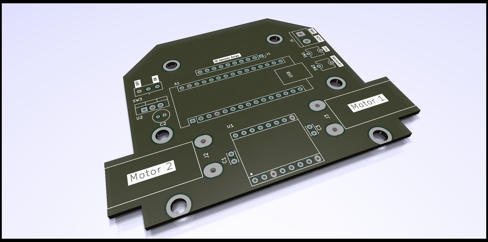
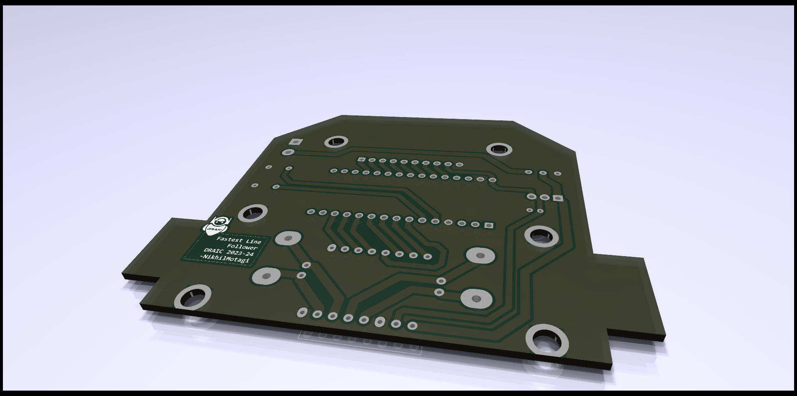
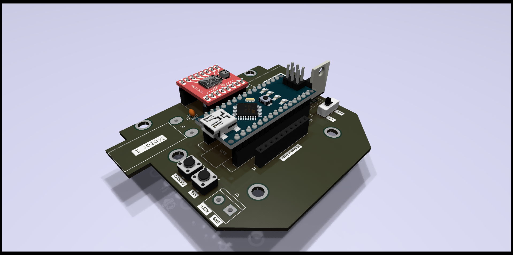

This autonomous robot is designed to accurately follow a defined black line on a white surface. It utilizes an Arduino Nano microcontroller as its brain, processing sensor data and controlling the robot's movement.

**Key Components:**

- **Microcontroller:** Arduino Nano
- **Sensors:** 8-Array IR Sensor
- **Motor Driver:** TB6612FNG
- **Motors:** N20 12V DC Motors
- **Power Supply:** 12V Battery with LM7805 Voltage Regulator

**Operation:**

1. **Sensor Input:** The 8-array IR sensor continuously scans the surface, detecting the contrast between the black line and the white background.
2. **Signal Processing:** The Arduino Nano processes the analog sensor readings, converting them into digital values.
3. **PID Control:** A Proportional-Integral-Derivative (PID) controller is implemented to regulate the robot's speed and steering. The PID algorithm analyzes the error between the desired line position and the actual position, adjusting the motor speeds accordingly.
4. **Motor Control:** The TB6612FNG motor driver receives commands from the Arduino Nano and controls the direction and speed of the two DC motors.

--- 
### Photo Gallery

| PCB Top View  | PCB Bottom View |
| -------- | ------- |
|  |  |

- Assembled render
  
-IRL

  ||  |
  | ----------| -------------|
